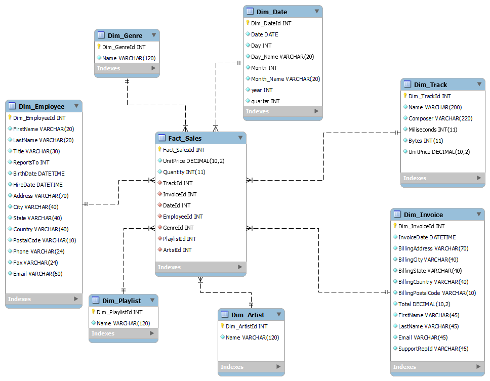
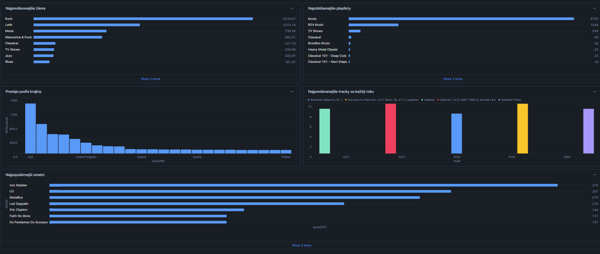

# Téma Projektu

---

Projekt je zameraný na analýzu predaja v rámci databázy Chinook DB. Táto databáza obsahuje údaje o digitálnom predaji hudby, vrátane informácií o zákazníkoch, produktoch, skladby, albumy, žánre a fakturácii.

## 1. Úvod a popis zdrojových dát 

Cieľom projektu je analyzovať predajné údaje s cieľom identifikovať hudobné žánre, ktoré sa najviac predávajú, a zistiť, ktoré playlists sú medzi zákazníkmi najobľúbenejšie. Okrem toho projekt skúma regionálne predajné trendy, aby odhalil oblasti s najvyšším predajom.

---

### 1.1 Základný popis každej tabuľky

1. **Albums**  
   Táto tabuľka obsahuje informácie o albumoch, vrátane názvu albumu a identifikátora umelca. Albumy sú dôležité pre analýzu najpredávanejších albumov a pre identifikáciu úspešných umelcov, čo je kľúčové pri skúmaní predajných trendov.  
   **Stĺpce:** AlbumId, Title, ArtistId  

2. **Artists**  
   Ukladá informácie o umelcoch, ktoré sú kľúčové pre analýzu najpredávanejších umelcov a žánrov. Prepojením s albumami a skladbami môžeme identifikovať úspešných umelcov.  
   **Stĺpce:** ArtistId, Name  

3. **Customers**  
   Obsahuje údaje o zákazníkoch, ako sú meno, adresa a krajina. Tieto informácie sú kľúčové pri skúmaní regionálnych predajných trendov.  
   **Stĺpce:** CustomerId, FirstName, LastName, Company, Address, City, State, Country, PostalCode, Phone, Fax, Email, SupportRepId  

4. **Employees**  
   Obsahuje údaje o zamestnancoch, ktorí poskytujú podporu zákazníkom. Tieto údaje môžu byť relevantné pri analýze interakcií so zákazníkmi, ale nie sú priamo spojené s cieľom identifikovať najpredávanejšie produkty alebo žánre.  
   **Stĺpce:** EmployeeId, LastName, FirstName, Title, ReportsTo, BirthDate, HireDate, Address, City, State, Country, PostalCode, Phone, Fax, Email  

5. **Genres**  
   Ukladá informácie o hudobných žánroch. Táto tabuľka je kľúčová pre analýzu najpredávanejších žánrov a identifikáciu trendov v predaji podľa žánrov.  
   **Stĺpce:** GenreId, Name  

6. **InvoiceLines**  
   Obsahuje podrobnosti o položkách faktúr, ako sú skladby a ich ceny. Táto tabuľka je nevyhnutná pre analýzu predaja jednotlivých skladieb a určovanie ich popularity.  
   **Stĺpce:** InvoiceLineId, InvoiceId, TrackId, UnitPrice, Quantity  

7. **Invoices**  
   Ukladá informácie o faktúrach, vrátane dátumu faktúry, zákazníka a celkovej sumy. Je to kľúčová tabuľka pre analýzu celkových tržieb, identifikáciu úspešných období a regionálnych predajných trendov.  
   **Stĺpce:** InvoiceId, CustomerId, InvoiceDate, BillingAddress, BillingCity, BillingState, BillingCountry, BillingPostalCode, Total  

8. **MediaTypes**  
   Ukladá informácie o formátoch médií, ako napríklad MP3 alebo AAC. Tieto údaje môžu byť užitočné na analýzu preferencií zákazníkov a ich vplyv na predaj podľa formátu skladby.  
   **Stĺpce:** MediaTypeId, Name  

9. **Playlists**  
   Obsahuje informácie o playlistoch, ktoré môžu obsahovať viacero skladieb. Analýza populárnych playlistov môže pomôcť identifikovať trendy v tom, aké skladby a žánre sú v rámci playlistov najobľúbenejšie.  
   **Stĺpce:** PlaylistId, Name  

10. **PlaylistTrack**  
    Táto tabuľka spája playlisty a skladby. Umožňuje analýzu obľúbenosti skladieb v rámci rôznych playlistov, čo môže naznačovať trendy v hudobných preferenciách zákazníkov.  
    **Stĺpce:** PlaylistId, TrackId  

11. **Tracks**  
    Ukladá podrobnosti o skladbách, ako sú názov, album, žáner, dĺžka skladby a cena. Táto tabuľka je kľúčová pre analýzu predajnosti jednotlivých skladieb, identifikáciu najobľúbenejších skladieb a albumov.  
    **Stĺpce:** TrackId, Name, AlbumId, MediaTypeId, GenreId, Composer, Milliseconds, Bytes, UnitPrice

### 1.2 ERD Diagram: Vzťahy medzi tabuľkami

ERD diagram znázorňuje vzťahy medzi tabuľkami v pôvodnej štruktúre zdrojových dát. Poskytuje prehľad o prepojeniach medzi entitami, ako sú zákazníci, faktúry, skladby a žánre. Obrázok nižšie zobrazuje tento diagram v plnej štruktúre.


## 2. Návrh dimenzionálneho modelu

### Faktová tabuľka: `Fact_Sales`
Faktová tabuľka obsahuje hlavné metriky a kľúče, ktoré sa budú používať pri analýze.

- **Hlavné metriky:**
  - `UnitPrice (DECIMAL(10,2))`: Cena za jednotku.
  - `Quantity (INT)`: Počet predaných jednotiek.
  
- **Kľúče:**
  - `Fact_SalesId (INT)`: Primárny kľúč faktovej tabuľky.
  - `TrackId (INT)`: Cudzí kľúč na dimenziu `Dim_Track`.
  - `InvoiceId (INT)`: Cudzí kľúč na dimenziu `Dim_Invoice`.
  - `DateId (INT)`: Cudzí kľúč na dimenziu `Dim_Date`.
  - `EmployeeId (INT)`: Cudzí kľúč na dimenziu `Dim_Employee`.
  - `GenreId (INT)`: Cudzí kľúč na dimenziu `Dim_Genre`.
  - `PlaylistId (INT)`: Cudzí kľúč na dimenziu `Dim_Playlist`.
  - `ArtistId (INT)`: Cudzí kľúč na dimenziu `Dim_Artist`.
  

---

### Dimenzie

#### 1. `Dim_Track`
Obsahuje informácie o skladbách.

- **Atribúty:**
  - `Dim_TrackId (INT)`: Primárny kľúč.
  - `Name (VARCHAR(200))`: Názov skladby.
  - `Composer (VARCHAR(220))`: Skladateľ.
  - `Milliseconds (INT)`: Dĺžka skladby v milisekundách.
  - `Bytes (INT)`: Veľkosť skladby v bajtoch.
  - `UnitPrice (DECIMAL(10,2))`: Cena za skladbu.

- **Typ dimenzie:** SCD Type 1 (jednoduché aktualizácie bez histórie).

---

#### 2. `Dim_Invoice`
Obsahuje informácie o faktúrach.

- **Atribúty:**
  - `Dim_InvoiceId (INT)`: Primárny kľúč.
  - `InvoiceDate (DATETIME)`: Dátum faktúry.
  - `BillingAddress (VARCHAR(70))`: Fakturačná adresa.
  - `BillingCity (VARCHAR(40))`: Mesto.
  - `BillingState (VARCHAR(40))`: Štát.
  - `BillingCountry (VARCHAR(40))`: Krajina.
  - `BillingPostalCode (VARCHAR(10))`: PSČ.
  - `Total (DECIMAL(10,2))`: Celková suma.
  - `FirstName (VARCHAR(45))`: Meno zákazníka.
  - `LastName (VARCHAR(45))`: Priezvisko zákazníka.
  - `Email (VARCHAR(45))`: Email zákazníka.

- **Typ dimenzie:** SCD Type 2 (sledovanie historických zmien).

---

#### 3. `Dim_Date`
Obsahuje informácie o dátumoch.

- **Atribúty:**
  - `Dim_DateId (INT)`: Primárny kľúč.
  - `Time (DATE)`: Dátum.
  - `Day (INT)`: Deň.
  - `Month (INT)`: Mesiac.
  - `Year (INT)`: Rok.

- **Typ dimenzie:** SCD Type 1.

---

#### 4. `Dim_Artist`
Obsahuje informácie o umelcoch.

- **Atribúty:**
  - `Dim_ArtistId (INT)`: Primárny kľúč.
  - `Name (VARCHAR(255))`: Meno umelca.

- **Typ dimenzie:** SCD Type 1.

---

#### 5. `Dim_Employee`
Obsahuje informácie o zamestnancoch.

- **Atribúty:**
  - `Dim_EmployeeId (INT)`: Primárny kľúč.
  - `FirstName (VARCHAR(20))`: Meno.
  - `LastName (VARCHAR(20))`: Priezvisko.
  - `Title (VARCHAR(30))`: Titul.
  - `ReportsTo (INT)`: ID nadriadeného.
  - `BirthDate (DATETIME)`: Dátum narodenia.
  - `HireDate (DATETIME)`: Dátum prijatia.
  - `Address (VARCHAR(70))`: Adresa.
  - `City (VARCHAR(40))`: Mesto.
  - `State (VARCHAR(40))`: Štát.
  - `Country (VARCHAR(40))`: Krajina.
  - `PostalCode (VARCHAR(10))`: PSČ.
  - `Phone (VARCHAR(24))`: Telefón.
  - `Fax (VARCHAR(24))`: Fax.
  - `Email (VARCHAR(60))`: Email.

- **Typ dimenzie:** SCD Type 2 (sledovanie historických zmien).

---

#### 6. `Dim_Genre`
Obsahuje informácie o žánroch.

- **Atribúty:**
  - `Dim_GenreId (INT)`: Primárny kľúč.
  - `Name (VARCHAR(255))`: Názov žánru.

- **Typ dimenzie:** SCD Type 1.

---

#### 7. `Dim_Playlist`
Obsahuje informácie o playlistoch.

- **Atribúty:**
  - `Dim_PlaylistId (INT)`: Primárny kľúč.
  - `Name (VARCHAR(255))`: Názov playlistu.

- **Typ dimenzie:** SCD Type 1.

---



## 3. ETL proces v nástroji Snowflake

### 3.1 Extract 

Tuto sa zameriava na získanie dát zo súborov formátu CSV uložených v stage a ich načítanie do dočasných tabuliek (staging tabuliek) v Snowflake.

**Vytvorenie stage**
```sql
CREATE OR REPLACE STAGE my_stage;
```
Tento príkaz vytvára alebo nahrádza dočasné úložisko `my_stage`, v ktorom môžeme ukladať dočasné súbory (v tomto prípade súbory vo formáte CSV) a potom ich spracovať.

**Načítanie dát z my_stage do staging tabuliek**

```sql
COPY INTO customer_staging
FROM @my_stage/customer.csv
FILE_FORMAT = (TYPE = 'CSV' FIELD_OPTIONALLY_ENCLOSED_BY = '"' SKIP_HEADER = 1); 
```

Tento prikaz kopíruje dáta zo súboru `customer.csv` v stage `my_stage` do tabuľky `customer_staging`. FIELD_OPTIONALLY_ENCLOSED_BY = '"' určuje hodnoty oddelené úvodzovkami.

### 3.2 Transform 

V tejto fáze ETL procesu zahŕňa spracovanie a úpravu dát z dočasných staging tabuliek do finálnych dimenzií a faktovej tabuľky. Tento krok je zásadný, pretože zabezpečuje, že dáta sú pripravené na analýzu a reportovanie. 

#### Vytvorenie dimenzií
Dimenzie vytvárame preto, aby sme mohli efektívne organizovať a analyzovať dáta. Dimenzie umožňujú lepšie pochopenie rôznych aspektov dát a poskytujú kontext pre faktové tabuľky.  vytvárať nasledujúce dimenzie:

- Dim_Artist
```sql
CREATE TABLE Dim_Artist AS
SELECT
    ar.ArtistId AS Dim_ArtistId,
    ar.Name
FROM Artist_staging ar;
```
Tento príkaz vytvára tabuľku `Dim_Artist` a uchováva údaje o umelcoch z `Artist_staging`.

- Dim_Genre
```sql
CREATE TABLE Dim_Genre AS
SELECT
    ge.GenreId AS Dim_GenreId,
    ge.Name 
FROM Genre_staging ge;
```
Tento príkaz vytvára tabuľku `Dim_Genre` a uchováva údaje o žánroch z `Genre_staging`.

- Dim_Playlist
```sql
CREATE TABLE Dim_Playlist AS
SELECT
    pl.PlaylistId AS Dim_PlaylistId,
    pl.Name 
FROM Playlist_staging pl;
```
Tento príkaz vytvára tabuľku `Dim_Playlist` a uchováva údaje o playlistoch z `Playlist_staging`.

- Dim_Track
```sql
CREATE TABLE Dim_Track AS
SELECT
    tr.TrackId AS Dim_TrackId,
    tr.Name,
    tr.Composer,
    tr.Milliseconds,
    tr.Bytes,
    tr.UnitPrice
FROM Track_staging tr;
```
Tento príkaz vytvára tabuľku `Dim_Track` a uchováva údaje o skladbách z `Track_staging`.

- Dim_Invoice
```sql
CREATE TABLE Dim_Invoice AS
SELECT
    inv.InvoiceId AS Dim_InvoiceId,
    cu.FirstName AS FirstName,
    cu.LastName AS LastName,
    inv.InvoiceDate,
    inv.BillingAddress,
    inv.BillingCity,
    inv.BillingState,
    inv.BillingCountry,
    inv.BillingPostalCode,
    inv.Total,
    cu.SupportRepId AS SupportRepId,
    cu.Email AS Email
FROM Invoice_staging inv
JOIN Customer_staging cu ON inv.CustomerId = cu.CustomerId;
```
Tento príkaz vytvára tabuľku `Dim_Invoice` a uchováva údaje o faktúrach z `Invoice_staging`a detaily zákazníka z `Customer_staging` meno, priezvisko, ID podporného zástupcu a email.

- Dim_Date
```sql
CREATE TABLE Dim_Date AS
SELECT DISTINCT
    ROW_NUMBER() OVER (ORDER BY CAST(i.InvoiceDate AS DATE)) AS Dim_DateId,
    CAST(i.InvoiceDate AS DATE) AS Date,
    DATE_PART('day', i.InvoiceDate) AS Day,
    DATE_PART('month', i.InvoiceDate) AS Month,
    DATE_PART('year', i.InvoiceDate) AS Year,
    DATE_PART('quarter', i.InvoiceDate) AS Quarter,
    CASE
        WHEN DATE_PART('dow', i.InvoiceDate) = 0 THEN 'Sunday'
        WHEN DATE_PART('dow', i.InvoiceDate) = 1 THEN 'Monday'
        WHEN DATE_PART('dow', i.InvoiceDate) = 2 THEN 'Tuesday'
        WHEN DATE_PART('dow', i.InvoiceDate) = 3 THEN 'Wednesday'
        WHEN DATE_PART('dow', i.InvoiceDate) = 4 THEN 'Thursday'
        WHEN DATE_PART('dow', i.InvoiceDate) = 5 THEN 'Friday'
        WHEN DATE_PART('dow', i.InvoiceDate) = 6 THEN 'Saturday'
    END AS Day_Name,
    DATE_PART('dow', i.InvoiceDate) + 1 AS Day_Week,
    EXTRACT(WEEK FROM DATE_TRUNC('WEEK', i.InvoiceDate + INTERVAL '1 DAY')) AS Week,
    CASE
        WHEN DATE_PART('month', i.InvoiceDate) = 1 THEN 'January'
        WHEN DATE_PART('month', i.InvoiceDate) = 2 THEN 'February'
        WHEN DATE_PART('month', i.InvoiceDate) = 3 THEN 'March'
        WHEN DATE_PART('month', i.InvoiceDate) = 4 THEN 'April'
        WHEN DATE_PART('month', i.InvoiceDate) = 5 THEN 'May'
        WHEN DATE_PART('month', i.InvoiceDate) = 6 THEN 'June'
        WHEN DATE_PART('month', i.InvoiceDate) = 7 THEN 'July'
        WHEN DATE_PART('month', i.InvoiceDate) = 8 THEN 'August'
        WHEN DATE_PART('month', i.InvoiceDate) = 9 THEN 'September'
        WHEN DATE_PART('month', i.InvoiceDate) = 10 THEN 'October'
        WHEN DATE_PART('month', i.InvoiceDate) = 11 THEN 'November'
        WHEN DATE_PART('month', i.InvoiceDate) = 12 THEN 'December'
    END AS Month_Name
FROM Invoice_staging i;
```
Tento príkaz vytvára tabuľku `Dim_Date` a uchováva údaje o dátumoch z `Invoice_staging`, získava údaje o dni, mesiaci, roku, štvrťroku, názve dňa, dni v týždni, týždni a názve mesiaca.

- Dim_Employee
```sql
CREATE TABLE Dim_Employee AS
SELECT
    em.EmployeeId AS Dim_EmployeeId,
    em.FirstName,
    em.LastName,
    em.Title,
    em.ReportsTo,
    em.BirthDate,
    em.HireDate,
    em.Address,
    em.City,
    em.State,
    em.Country,
    em.PostalCode,
    em.Phone,
    em.Fax,
    em.Email
FROM Employee_staging em;
```
Tento príkaz vytvára tabuľku `Dim_Employee` a uchováva údaje o zamestnancoch z `Employee_staging`.

---

#### Faktová Tabuľka

- Fact_Sales
```sql
CREATE TABLE Fact_Sales AS
SELECT
    il.InvoiceLineId AS Fact_SalesId,
    il.UnitPrice AS UnitPrice,
    il.Quantity AS Quantity,
    di.Dim_InvoiceId AS InvoiceId,
    dt.Dim_TrackId AS TrackId,
    dd.Dim_DateId AS DateId,
    de.Dim_EmployeeId AS EmployeeId,
    dg.Dim_GenreId AS GenreId,
    dp.Dim_PlaylistId AS PlaylistId,
   da.Dim_ArtistId AS ArtistId
FROM InvoiceLine_staging il
JOIN Dim_Track dt ON il.TrackId = dt.Dim_TrackId
JOIN Dim_Invoice di ON il.InvoiceId = di.Dim_InvoiceId
JOIN Dim_Date dd ON CAST(di.InvoiceDate AS DATE) = dd.Date
JOIN Dim_Employee de ON di.SupportRepId = de.Dim_EmployeeId
LEFT JOIN Track_staging tr ON il.TrackId = tr.TrackId
LEFT JOIN PlaylistTrack_staging pt ON il.TrackId = pt.TrackId
LEFT JOIN Album_staging al ON tr.AlbumId = al.AlbumId
LEFT JOIN Artist_staging ar ON al.ArtistId = ar.ArtistId
LEFT JOIN Dim_Genre dg ON tr.GenreId = dg.Dim_GenreId
LEFT JOIN Dim_Playlist dp ON pt.PlaylistId = dp.Dim_PlaylistId
LEFT JOIN Dim_Artist da ON ar.ArtistId = da.Dim_ArtistId;
```
Tento príkaz vytvára tabuľku `Fact_Sales` a uchováva údaje o predajoch z rôznych staging tabuliek a dimenzií, pričom spája príslušné dimenzie na nové stĺpce v tabuľke `Fact_Sales`. Tento krok zabezpečuje, že všetky potrebné informácie sú zahrnuté a pripravené na analýzu.

### 3.3 Load

V poslednej fáze ETL procesu sa dáta načítajú do finálnych tabuliek. Po vytvorení finálnych tabuliek sa staging tabuľky zmažú, aby sa uvoľnilo miesto, znížila zložitosť databázy a efektívne spravovali dáta.

```sql
DROP TABLE Artist_staging;
DROP TABLE Album_staging;
DROP TABLE MediaType_staging;
DROP TABLE Genre_staging;
DROP TABLE Track_staging;
DROP TABLE Playlist_staging;
DROP TABLE PlaylistTrack_staging;
DROP TABLE Employee_staging;
DROP TABLE Customer_staging;
DROP TABLE Invoice_staging;
DROP TABLE InvoiceLine_staging;
```

---

## 4.Vizualizácia dát

Dashboard obsahuje 5 vizualizácií, ktoré poskytujú prehľad o predajných trendoch a preferenciách zákazníkov. Tieto vizualizácie pomáhajú identifikovať najpredávanejšie žánre,playlisty, ako aj regionálne predajné trendy. Zlepšujú pochopenie správania zákazníkov a umožňujú lepšie rozhodovanie na základe dát.



### Graf 1: Najpredávanejšie Žánre

Tento graf zobrazuje celkový predaj podľa jednotlivých hudobných žánrov. Pomáha zodpovedať otázku, ktorý hudobný žáner generuje najvyššie príjmy z predaja.

```sql
SELECT
    dg.Name AS Genre,
    SUM(fs.UnitPrice * fs.Quantity) AS TotalSales
FROM Fact_Sales fs
JOIN Dim_Genre dg ON fs.GenreId = dg.Dim_GenreId
GROUP BY dg.Name
ORDER BY TotalSales DESC
LIMIT 10;
```

### Graf 2: Najobľúbenejšie Playlisty

Tento graf zobrazuje počet skladieb v jednotlivých playlistoch. Pomáha zodpovedať otázku, ktoré playlisty sú najpopulárnejšie.

```sql
SELECT
    dp.Name AS Playlist,
    COUNT(fs.PlaylistId) AS PlaylistCount
FROM Fact_Sales fs
JOIN Dim_Playlist dp ON fs.PlaylistId = dp.Dim_PlaylistId
GROUP BY dp.Name
ORDER BY PlaylistCount DESC
LIMIT 10;
```

### Graf 3: Predaje Podľa Krajiny

Tento graf zobrazuje celkový predaj podľa jednotlivých krajín. Pomáha zodpovedať otázku, v ktorých krajinách sú najvyššie predaje.

```sql
SELECT
    di.BillingCountry AS Country,
    SUM(fs.UnitPrice * fs.Quantity) AS TotalSales
FROM Fact_Sales fs
JOIN Dim_Invoice di ON fs.InvoiceId = di.Dim_InvoiceId
GROUP BY di.BillingCountry
ORDER BY TotalSales DESC;
```

### Graf 4: Najpredávanejšie Skladby za Každý Rok

Tento graf zobrazuje najpredávanejšie skladby za každý rok. Pomáha zodpovedať otázku, ktoré skladby boli najpredávanejšie v jednotlivých rokoch.

```sql
SELECT
    Year,
    Track,
    TotalSales
FROM (
    SELECT
        dt.Name AS Track,
        dd.year AS Year,
        SUM(fs.UnitPrice * fs.Quantity) AS TotalSales,
        ROW_NUMBER() OVER (PARTITION BY dd.year ORDER BY SUM(fs.UnitPrice * fs.Quantity) DESC) AS rn
    FROM Fact_Sales fs
    JOIN Dim_Track dt ON fs.TrackId = dt.Dim_TrackId
    JOIN Dim_Date dd ON fs.DateId = dd.Dim_DateId
    GROUP BY dt.Name, dd.year
) ranked_tracks
WHERE rn = 1
ORDER BY Year, TotalSales DESC;
```

### Graf 5: Najpopulárnejší Umelci

Tento graf zobrazuje počet predaných jednotiek pre jednotlivých umelcov. Pomáha zodpovedať otázku, ktorí umelci sú najpopulárnejší podľa počtu predaných jednotiek.

```sql
SELECT
    da.Name AS Artist,
    SUM(fs.Quantity) AS Quantity
FROM Fact_Sales fs
JOIN Dim_Artist da ON fs.ArtistId = da.Dim_ArtistId
GROUP BY da.Name
ORDER BY Quantity DESC
LIMIT 10;
```

---
**Autor**: Emil Tuan Anh Pham Dac
