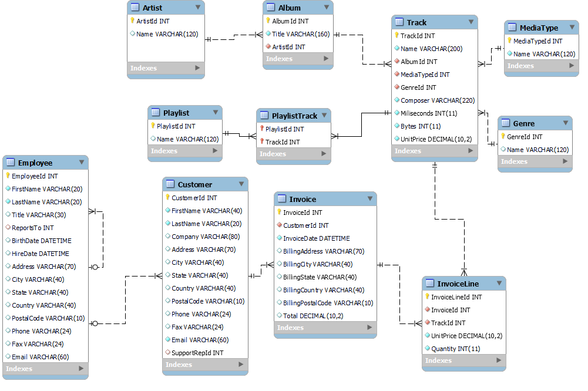

# Téma Projektu

Projekt je zameraný na analýzu predaja v rámci databázy Chinook DB. Táto databáza obsahuje údaje o digitálnom predaji hudby, vrátane informácií o zákazníkoch, produktoch, skladby, albumy, žánre a fakturácii.

## 1. Úvod a popis zdrojových dát 

Cieľom projektu je analyzovať predajné údaje s cieľom identifikovať hudobné žánre, ktoré sa najviac predávajú, a zistiť, ktoré skladby a albumy sú medzi zákazníkmi najobľúbenejšie. Okrem toho projekt skúma regionálne predajné trendy, aby odhalil oblasti s najvyšším predajom.

### 1.1 Základný popis každej tabuľky

1. **Albums**  
   Táto tabuľka obsahuje informácie o albumoch, vrátane názvu albumu a identifikátora umelca. Albumy sú dôležité pre analýzu najpredávanejších albumov a pre identifikáciu úspešných umelcov, čo je kľúčové pri skúmaní predajných trendov.  
   **Stĺpce:** AlbumId, Title, ArtistId  

2. **Artists**  
   Ukladá informácie o umelcoch, ktoré sú kľúčové pre analýzu najpredávanejších umelcov a žánrov. Prepojením s albumami a skladbami môžeme identifikovať úspešných umelcov.  
   **Stĺpce:** ArtistId, Name  

3. **Customers**  
   Obsahuje údaje o zákazníkoch, ako sú meno, adresa a krajina. Tieto informácie sú kľúčové pri skúmaní regionálnych predajných trendov.  
   **Stĺpce:** CustomerId, FirstName, LastName, Company, Address, City, State, Country, PostalCode, Phone, Fax, Email, SupportRepId  

4. **Employees**  
   Obsahuje údaje o zamestnancoch, ktorí poskytujú podporu zákazníkom. Tieto údaje môžu byť relevantné pri analýze interakcií so zákazníkmi, ale nie sú priamo spojené s cieľom identifikovať najpredávanejšie produkty alebo žánre.  
   **Stĺpce:** EmployeeId, LastName, FirstName, Title, ReportsTo, BirthDate, HireDate, Address, City, State, Country, PostalCode, Phone, Fax, Email  

5. **Genres**  
   Ukladá informácie o hudobných žánroch. Táto tabuľka je kľúčová pre analýzu najpredávanejších žánrov a identifikáciu trendov v predaji podľa žánrov.  
   **Stĺpce:** GenreId, Name  

6. **InvoiceLines**  
   Obsahuje podrobnosti o položkách faktúr, ako sú skladby a ich ceny. Táto tabuľka je nevyhnutná pre analýzu predaja jednotlivých skladieb a určovanie ich popularity.  
   **Stĺpce:** InvoiceLineId, InvoiceId, TrackId, UnitPrice, Quantity  

7. **Invoices**  
   Ukladá informácie o faktúrach, vrátane dátumu faktúry, zákazníka a celkovej sumy. Je to kľúčová tabuľka pre analýzu celkových tržieb, identifikáciu úspešných období a regionálnych predajných trendov.  
   **Stĺpce:** InvoiceId, CustomerId, InvoiceDate, BillingAddress, BillingCity, BillingState, BillingCountry, BillingPostalCode, Total  

8. **MediaTypes**  
   Ukladá informácie o formátoch médií, ako napríklad MP3 alebo AAC. Tieto údaje môžu byť užitočné na analýzu preferencií zákazníkov a ich vplyv na predaj podľa formátu skladby.  
   **Stĺpce:** MediaTypeId, Name  

9. **Playlists**  
   Obsahuje informácie o playlistoch, ktoré môžu obsahovať viacero skladieb. Analýza populárnych playlistov môže pomôcť identifikovať trendy v tom, aké skladby a žánre sú v rámci playlistov najobľúbenejšie.  
   **Stĺpce:** PlaylistId, Name  

10. **PlaylistTrack**  
    Táto tabuľka spája playlisty a skladby. Umožňuje analýzu obľúbenosti skladieb v rámci rôznych playlistov, čo môže naznačovať trendy v hudobných preferenciách zákazníkov.  
    **Stĺpce:** PlaylistId, TrackId  

11. **Tracks**  
    Ukladá podrobnosti o skladbách, ako sú názov, album, žáner, dĺžka skladby a cena. Táto tabuľka je kľúčová pre analýzu predajnosti jednotlivých skladieb, identifikáciu najobľúbenejších skladieb a albumov.  
    **Stĺpce:** TrackId, Name, AlbumId, MediaTypeId, GenreId, Composer, Milliseconds, Bytes, UnitPrice

### 1.2 ERD Diagram: Vzťahy medzi tabuľkami

ERD diagram znázorňuje vzťahy medzi tabuľkami v pôvodnej štruktúre zdrojových dát. Poskytuje prehľad o prepojeniach medzi entitami, ako sú zákazníci, faktúry, skladby a žánre. Obrázok nižšie zobrazuje tento diagram v plnej štruktúre.

## 2. Návrh dimenzionálneho modelu

## Faktová tabuľka: `Fact_Sales`
Faktová tabuľka obsahuje hlavné metriky a kľúče, ktoré sa budú používať pri analýze.

- **Hlavné metriky:**
  - `UnitPrice (DECIMAL(10,2))`: Cena za jednotku.
  - `Quantity (INT)`: Počet predaných jednotiek.
  
- **Kľúče:**
  - `Fact_SalesId (INT)`: Primárny kľúč faktovej tabuľky.
  - `TrackId (INT)`: Cudzí kľúč na dimenziu `Dim_Track`.
  - `InvoiceId (INT)`: Cudzí kľúč na dimenziu `Dim_Invoice`.
  - `DateId (INT)`: Cudzí kľúč na dimenziu `Dim_Date`.
  - `TimeId (INT)`: Cudzí kľúč na dimenziu `Dim_Time`.
  - `EmployeeId (INT)`: Cudzí kľúč na dimenziu `Dim_Employee`.

---

## Dimenzie

### 1. `Dim_Track`
Obsahuje informácie o skladbách.

- **Atribúty:**
  - `Dim_TrackId (INT)`: Primárny kľúč.
  - `Name (VARCHAR(200))`: Názov skladby.
  - `Composer (VARCHAR(220))`: Skladateľ.
  - `Miliseconds (INT)`: Dĺžka skladby v milisekundách.
  - `Bytes (INT)`: Veľkosť skladby v bajtoch.
  - `UnitPrice (DECIMAL(10,2))`: Cena za skladbu.
  - `MediaType (VARCHAR(45))`: Typ média.
  - `Genre (VARCHAR(45))`: Žáner.
  - `Album (VARCHAR(45))`: Album.
  - `Artist (VARCHAR(45))`: Umelec.
  - `Playlist (VARCHAR(45))`: Playlist.

- **Typ dimenzie:** SCD Type 1 (jednoduché aktualizácie bez histórie).

---

### 2. `Dim_Invoice`
Obsahuje informácie o faktúrach.

- **Atribúty:**
  - `Dim_InvoiceId (INT)`: Primárny kľúč.
  - `InvoiceDate (DATETIME)`: Dátum faktúry.
  - `BillingAddress (VARCHAR(70))`: Fakturačná adresa.
  - `BillingCity (VARCHAR(40))`: Mesto.
  - `BillingState (VARCHAR(40))`: Štát.
  - `BillingCountry (VARCHAR(40))`: Krajina.
  - `BillingPostalCode (VARCHAR(10))`: PSČ.
  - `Total (DECIMAL(10,2))`: Celková suma.
  - `Customer_FirstName (VARCHAR(45))`: Meno zákazníka.
  - `Customer_LastName (VARCHAR(45))`: Priezvisko zákazníka.
  - `Email (VARCHAR(45))`: Email zákazníka.

- **Typ dimenzie:** SCD Type 2 (sledovanie historických zmien).

---

### 3. `Dim_Date`
Obsahuje informácie o dátumoch.

- **Atribúty:**
  - `Dim_DateId (INT)`: Primárny kľúč.
  - `Time (DATE)`: Dátum.
  - `Day (INT)`: Deň.
  - `Month (INT)`: Mesiac.
  - `Year (INT)`: Rok.

- **Typ dimenzie:** SCD Type 1.

---

### 4. `Dim_Time`
Obsahuje informácie o čase.

- **Atribúty:**
  - `Dim_TimeId (INT)`: Primárny kľúč.
  - `Minute (VARCHAR(45))`: Minúta.
  - `Hour (VARCHAR(45))`: Hodina.

- **Typ dimenzie:** SCD Type 1.

---

### 5. `Dim_Employee`
Obsahuje informácie o zamestnancoch.

- **Atribúty:**
  - `Dim_EmployeeId (INT)`: Primárny kľúč.
  - `FirstName (VARCHAR(20))`: Meno.
  - `LastName (VARCHAR(20))`: Priezvisko.
  - `Title (VARCHAR(30))`: Titul.
  - `ReportsTo (INT)`: ID nadriadeného.
  - `BirthDate (DATETIME)`: Dátum narodenia.
  - `HireDate (DATETIME)`: Dátum prijatia.
  - `Address (VARCHAR(70))`: Adresa.
  - `City (VARCHAR(40))`: Mesto.
  - `State (VARCHAR(40))`: Štát.
  - `Country (VARCHAR(40))`: Krajina.
  - `PostalCode (VARCHAR(10))`: PSČ.
  - `Phone (VARCHAR(24))`: Telefón.
  - `Fax (VARCHAR(24))`: Fax.
  - `Email (VARCHAR(60))`: Email.

- **Typ dimenzie:** SCD Type 2 (sledovanie historických zmien).

---

Tento model umožňuje efektívnu analýzu predaja podľa rôznych dimenzií, ako sú skladby, faktúry, dátumy, časy a zamestnanci.
